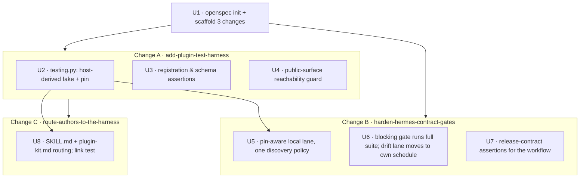
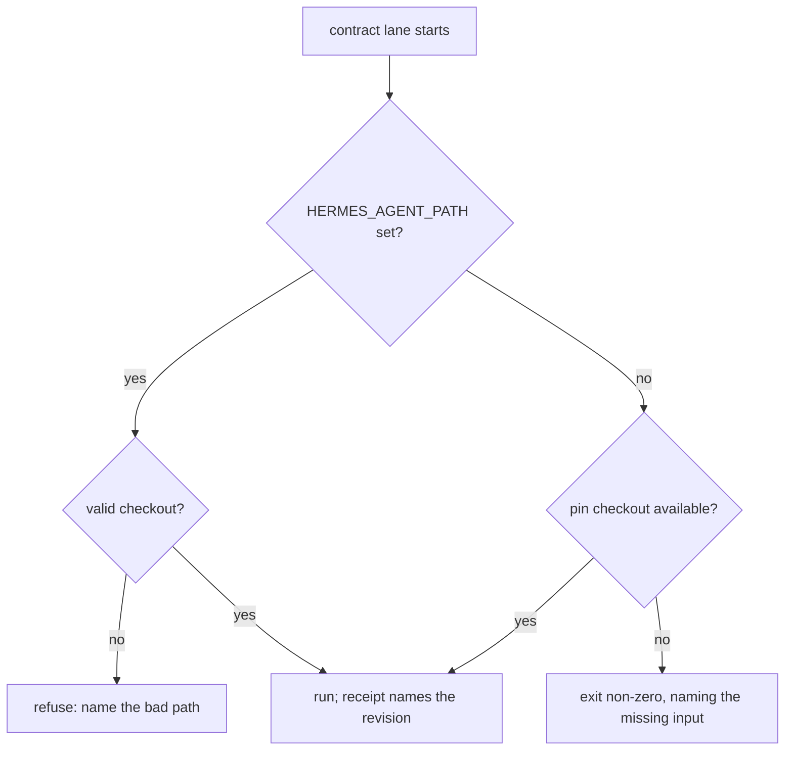

# Plugin Contract Testing Harness - Plan

## Goal Capsule

- Objective: a Hermes plugin author — human or coding agent — can prove their plugin still satisfies the Hermes runtime contract at the Hermes revision actually deployed, and finds out when an upstream Hermes change breaks it before that change reaches production.
- Means: export a record-and-replay test harness from the installed package and split the contract lanes into a blocking pinned gate and a scheduled drift gate (KTD1, KTD4, KTD10).
- Authority: requirements govern behavior; KTDs govern mechanism. Where a unit disagrees with a cited R or KTD, the cited entry wins.
- Execution profile: three OpenSpec changes delivered in dependency order; each is independently reviewable, and shippable in that order.
- Stop conditions: stop and ask if `openspec validate` cannot accept a change shape this plan assumes, or if exporting the harness would require a runtime dependency the kit does not already carry.
- Finishes the work: `ce-work`, or the author who picks up a phase.

---

## Product Contract

### Summary

Ship a public `hermes_plugin_kit.testing` surface so plugin authors stop hand-rolling fake plugin contexts, make the blocking CI gate run the full contract suite at the deployed Hermes pin, give the upstream-drift lane a voice, and make the local contract lane pin-aware instead of silently green. Delivered as three OpenSpec changes.

### Problem Frame

Fifteen repositories on this machine independently define a fake Hermes plugin context — fourteen consumer plugins plus the kit itself. Across the fourteen consumers, eight use a strict positional `register_skill(self, name, path, description="")`, three use a permissive `**kwargs` form, and three define no skill registrar at all; the kit's own fake is a fourth permissive one. Every one of them is an author who needed a harness, could not find one, and wrote a weaker substitute. The kit's own `FakePluginCtx` and its real-Hermes import seam live in `tests/`, which never reaches a consumer: consumers install via `git+…@sha`, and the wheel carries only `hermes_plugin_kit/__init__.py` and `hermes_plugin_kit/observability.py`.

The repository already teaches the principle it cannot deliver. `skills/hermes-plugins/references/plugin-kit.md:98-99` states that "a fake context alone can hide signature drift," and `skills/hermes-plugins/SKILL.md` instructs an agent to "run contract tests against the real pinned Hermes Agent checkout" — an instruction no consumer can carry out, because the fake, the import seam, and the pin all live outside anything they install.

The gap is not hypothetical. Hermes commit `866332bf` (#99220) added `gateway/relay/egress.py`, which refuses `send_message` to relay targets whose routing is not attested. The kit's media host-tool contract passes against the pinned Hermes revision `f80f453` (2026-08-14) and fails against upstream main `a6bab19` (2026-09-21). Nobody was paged: the job that would have caught it carries `continue-on-error: true` and emits no summary, and the blocking job runs only `tests.test_context_engine_contract` — 110 lines of an 853-line contract suite that is fully green at that same pin.

### Key Decisions

- Resolving the #99220 relay-egress break in `deliver_media` is out of scope (session-settled: user-directed — chosen over bundling it with the harness work: the drift is the motivating evidence for building the gate, and fixing it is a separate objective with its own proof boundary). Governs R14.
- Work is delivered as three OpenSpec changes cut on dependency lines rather than one combined change or five per-item changes (session-settled: user-approved — chosen over one-change and five-change cuts: the CI gate work ships today, the consumer lane cannot start until the harness exists). Governs R15.
- The consumer contract lane stops at the kit shipping a harness and a documented recipe; it does not convert any consumer repository's hand-rolled fake (session-settled: user-approved — chosen over migrating consumers in the same change: adoption cost belongs to each consumer's own release cadence). Governs R16.
- The harness fetches a Hermes checkout at the pin whenever none resolves, rather than only reporting what to provision (session-settled: user-directed — chosen over validate-and-instruct and an opt-in fetch: a step that merely instructs leaves every consumer on the record-only path, which is the gap the harness exists to close). Governs R17.

### Requirements

**Harness surface**

- R1. `hermes_plugin_kit.testing` is importable from an installed wheel, with no new runtime dependency and no test-framework import at module import time.
- R2. The fake records the registration calls a plugin makes, and those recorded calls are replayed against the real Hermes `PluginContext` signatures wherever a Hermes checkout is importable, so a host adding or renaming a required parameter fails rather than passing.
- R3. The fake is usable with no Hermes checkout present, and a run that could not perform the replay says so rather than presenting itself as drift-checked. When no checkout is available, the harness names the exact revision a consumer must provision to enable the replay.
- R4. A drift failure names the registrar and the parameter that drifted, rather than only raising.
- R5. Registration assertions cover the receipt's stable log field order, duplicate detection, deterministic ordering, and the schema-under-`function.parameters` convention, so a consumer asserts them without copying literals.
- R6. The harness ships the deployed Hermes revision as a machine-readable constant, and the CI workflow's pin literal is test-enforced to agree with it.

**Contract lanes**

- R7. The blocking CI gate runs the full Hermes contract suite at the deployed pin, not only the context-engine module.
- R8. The upstream-drift lane runs when Hermes moves rather than only when the kit changes, stays outside required checks, and emits a visible record naming the failing tests and the Hermes revision exercised.
- R9. A contract run states which Hermes revision it exercised and how many tests actually executed, or refuses; a run in which everything skipped or nothing was collected must not report success.
- R10. The local lane can target the deployed pin, not only whatever the default branch currently is.
- R11. Hermes checkout discovery follows one policy across both contract modules.

**Discoverability**

- R12. Every public name the kit documents — the harness surface and existing exports such as `plugin_reference_tool` — is reachable through the package's public import path and is covered by a guard that fails when it is not.
- R13. `skills/hermes-plugins/SKILL.md` and `skills/hermes-plugins/references/plugin-kit.md` route an author to the harness by import path, and their reference-file links are covered by a test.

**Delivery**

- R14. The plan changes no behavior in `deliver_media` or `invoke_host_tool`.
- R15. Each OpenSpec change validates under `openspec validate` and is reviewable on its own.
- R16. No consumer repository's hand-rolled fake context is converted; the consumer lane ends at the kit shipping the harness and a documented recipe.
- R17. The harness ships a Python-invocable step that resolves a Hermes checkout at the pin, fetching one when none is present, so the drift replay runs on a consumer's machine rather than only inside this repository.

### Success Criteria

- A fresh consumer repository with no Hermes checkout on the machine can follow the skill's Validation section and get an explicit receipt — a pass naming a revision, or a refusal naming what is missing — never a green run with the contract suite absent.
- Re-running the #99220 scenario against upstream main produces a named, readable CI record instead of silence.
- A plugin author migrating from a hand-rolled fake deletes more lines than they add.

### Scope Boundaries

- Converting any consumer repository's fake, per R16.
- Changing media delivery or relay attestation behavior, per R14.
- Bumping the deployed Hermes pin past `f80f453`. Promotion is infra's snapshot objective; this plan only makes the pin readable and the gate honest.

#### Deferred to Follow-Up Work

- Version-coupling the skill to the pinned kit revision. The skill is consumed as a symlink to a moving checkout (`README.md:689`) while `AGENTS.md` requires consumers to pin the kit immutably, so the skill an author reads and the kit revision they install can drift apart. Out of scope here; worth its own change.
- Exposing the harness to the Hermes runtime agent loop via `plugin_reference_tool` or a registered tool. The harness is dev-time, invoked from a consumer's test runner. Recorded so it does not drift into scope.
- A tracking-issue lifecycle for the drift lane — one issue kept in sync, closed when the lane goes green, with repeat reports suppressed until the upstream revision changes. R8 asks for a visible record, which the job summary and an honestly-red workflow already give; an issue manager is a stateful subsystem needing a permission the workflow does not currently grant. Worth doing once the lane has proven it fires, not before.

---

## Planning Contract

### Key Technical Decisions

- KTD1. Record the plugin's registration calls in a permissive fake, then replay those recorded arguments through the real `PluginContext` signatures wherever the host is importable. Probing five candidate techniques settled this. A permissive `**kwargs` fake and a hand-written positional fake mirroring today's host both pass unchanged when the host gains a required parameter — the positional fake is a frozen snapshot, not a stricter contract. Comparing the fake's own signature to the real one also catches nothing, because `**kwargs` is compatible with every signature by construction. `create_autospec` does catch it, but only where the real class is importable, which a consumer's machine generally is not — so it cannot be the mechanism in the shipped fake. Replaying recorded arguments through the real signature catches the drift shapes and needs the host only at check time: an added required parameter reports `missing a required argument`, and a renamed keyword reports `got an unexpected keyword argument`. A renamed *positional* parameter is the one case binding alone misses, because Python binds those by position and the call still fits — so the replay also compares parameter names for the registrars the kit calls positionally. An independent cross-model review found that gap after the first implementation; a probe confirmed it and the fix landed. Strictness is not the axis, and neither is derivation — separating *recording* (always available) from *checking* (available when the host is) is. Governs R2, R3, R4.
- KTD2. Ship a flat `hermes_plugin_kit/testing.py`, not a `hermes_plugin_kit/testing/` subpackage. `pyproject.toml:34` declares `packages = ["hermes_plugin_kit"]` as an explicit list, so a subpackage is silently omitted from the wheel and the existing `package` CI job would not notice; the built wheel today contains exactly the two flat modules. This mirrors the `observability.py` precedent. Governs R1.
- KTD3. Assert the receipt's **log** field order, not the dataclass field order. They genuinely differ — `RegistrationSummary` declares `tools, hooks, skills, …` while `log_registration_summary` emits `commands, cli_commands, tools, …`. The log string is the external contract `AGENTS.md` pins. Governs R5.
- KTD4. The pin lives in `hermes_plugin_kit/testing.py`, the workflow keeps a literal, and a release-contract test asserts the two agree (session-settled: user-approved — chosen over reading infra's deployed-snapshot receipt: a constant that ships in the wheel is the only form a consumer can read offline, and it keeps R6 free of a cross-repo dependency). The workflow cannot read the constant: `actions/checkout` consumes the `ref:` before `setup-uv` installs Python, so a dynamic read would mean reordering the job to install a toolchain ahead of the host checkout. Test-enforced agreement gets the same single-source-of-truth property through the route KTD5 already chose. Today the pin is two unlinked literals at `.github/workflows/test.yml:52` and `:66`, readable only inside CI and agreeing with nothing. Governs R6, R7.
- KTD5. Extend the existing workflow-as-contract tests in `tests/test_release_contract.py` rather than adding a parallel mechanism. That module already parses `test.yml` and asserts SHA-pinned actions (`:638`), `just`-only steps (`:649`), justfile-as-sole-runner (`:687`), and absence of `pull_request_target` (`:691`). Job *names* are asserted nowhere, so jobs may be added or renamed freely. Governs R7, R8.
- KTD6. Keep the upstream-drift lane non-blocking and give it a reporting step (session-settled: user-approved — chosen over making it blocking: it tracks a moving target, so blocking would put Hermes' merge queue in this repo's critical path). Governs R8.
- KTD7. Expose the harness as composable pieces — fake context, pin constant, conformance check, assertion helpers — rather than one opaque "run the lane" entry point, so an author can take just registration parity. The lane entry point is Python-invocable because consumer repositories predominantly use `make`, not `just`; a recipe documented only as `just test-contract` is unusable in the repositories that need it. Governs R5, R12.
- KTD8. Consolidate Hermes discovery on the stricter of the two existing policies: an explicit `HERMES_AGENT_PATH` is authoritative and re-raises on a bad path, and absence produces an explicit outcome rather than a silent skip. `tests/test_hermes_contract.py:37-126` already does the former with staleness guards; `tests/test_context_engine_contract.py:16-36` is env-only and returns `None` into a silent skip. Governs R9, R11.

- KTD9. Prove a contract run happened by asserting the executed-test count, not by trusting the exit code. On Python 3.11 — the version CI pins — `unittest` exits 0 both when every test skips and when zero tests are collected; the `NO TESTS RAN` exit-5 behavior only arrives in 3.12. Verified on both versions. So "the contract gate passed" and "the contract gate ran" are today indistinguishable from the exit status alone. Each contract module also gets a guard test outside the `skipUnless` decorator, so an intended-but-unconfigured run fails instead of vanishing. Governs R9.
- KTD10. Move the upstream-drift lane to its own scheduled workflow instead of repairing the flag on the existing job. The current job cannot warn about drift at all: `test.yml` triggers only on `push` and `pull_request`, so it runs when the kit changes and never when Hermes moves — which is the only event it exists to detect. Job-level `continue-on-error: true` compounds it by rendering the job green in the checks list rather than visibly amber. A separate `schedule` + `workflow_dispatch` workflow, outside required checks and carrying no `continue-on-error`, fires on the right event and is honestly red when it fails. This keeps KTD6's settled non-blocking property — a workflow that is not a required check cannot block a merge — while giving the lane a trigger it currently lacks. Governs R8.
- KTD11. Gate each change on `openspec show <change> --diff` in addition to `openspec validate`. A `MODIFIED` header that matches nothing in the main spec passes `validate --strict` at exit 0 and is then refused at archive time, so validation green does not predict a successful archive. Separately, `archive -y` does not block on unchecked tasks; `openspec validate --archived` is the only check that catches them. Governs R15.

- KTD12. Migrate the kit's own `FakePluginCtx` and the bespoke host-shape classes around it onto the harness, not the fake alone (session-settled: user-approved — chosen over a fake-only swap and over deferring: only the host-shape classes exercise the `references_dir` switch and the missing-registrar mode the way a consumer would, and the fuller migration is what gives the line-delta success criterion a real number). Governs R5.

A Bake-off was considered for KTD1 and did not qualify: the four candidate mechanisms were already concrete enough to compare directly, and a single probe settled them, so the decision needed judgment rather than development.

### High-Level Technical Design

Three OpenSpec changes, cut so each is independently shippable and the dependency runs one way:

Change B cannot precede Change A. Its discovery-policy consolidation and full-suite selection are conceptually independent, but all three of its units consume the pin constant U2 places in the harness module: U5 runs the suite at that pin, U6 sources the workflow's pin from it, and U7 asserts the two agree. If the harness slips, Change B waits. The contract lane resolves a host in one policy:

### Assumptions

- `openspec validate` accepts a change whose `.openspec.yaml` sets `skip_specs: true` for tooling-only work; the template states this and the validator's error message names it as the remedy.
- The deployed pin `f80f453` remains the revision infra deploys for the life of this work. If infra promotes mid-flight, R6's constant changes value, not shape.

### Sequencing

U1 first and outside any change (a change cannot scaffold itself). Then Change A (U2 → U3, U4), then Change B (U5 → U6 → U7), then Change C (U8). Within Change B, U7 lands with or after U6 so the assertion and the workflow move together.

OpenSpec has no cross-change dependency mechanism — there is no `depends_on`, and nothing in its status, validate, or doctor output models one. Ordering is therefore a convention this plan asserts, enforced only indirectly: a later change's `MODIFIED` delta must be written against the post-archive main spec or validation rejects it. Because the three changes here touch disjoint capabilities, that indirect enforcement does not apply, so the sequence above is the only thing keeping them in order. Archive them in that order.

---

## Implementation Units

### U1. Initialize OpenSpec and scaffold the three changes

- Goal: OpenSpec exists in the repo and the three change directories are created, so subsequent units author into them.
- Requirements: R15
- Dependencies: none
- Files: `openspec/config.yaml`, `openspec/changes/add-plugin-test-harness/.openspec.yaml`, `openspec/changes/harden-hermes-contract-gates/.openspec.yaml`, `openspec/changes/route-authors-to-the-harness/.openspec.yaml`, `justfile`, `.gitignore`
- Approach:
  1. OpenSpec is already at 1.13.1 — upgraded from 1.13.0 during planning, because those two releases together fix four defects where archive exited 0 having applied less than the delta specified, and a silent partial archive is the worst failure mode for a spec store meant to be authoritative. Confirm the version before initializing rather than assuming; a machine that missed the upgrade reintroduces those defects.
  2. Initialize with agent-instruction files suppressed, per the confirmed scope — the repo's `AGENTS.md` already owns agent guidance and a second instruction surface would compete with it. Verified that this writes nothing outside the project and leaves `AGENTS.md` untouched.
  3. Create the three changes named above.
  4. Set `skip_specs: true` on the two changes that alter no capability requirements (gates, routing). The harness change introduces a new capability and carries a real spec delta, so it does not get the marker. The shipped template is explicit that a requirement must not be invented to satisfy validation.
  5. Populate `openspec/config.yaml`'s `context:` with the repo's stack and conventions so artifact authoring is grounded.
  6. Add a `justfile` recipe that refuses to run when the installed OpenSpec is below the floor, and route `validate`, `show --diff`, and `archive` through it. Every other tool this repository depends on carries an enforced version — `just` is pinned in CI, actions are SHA-pinned — while the archive-correctness property this plan rests on would otherwise live only on whichever machine happened to upgrade.
- Patterns to follow: `openspec init --tools none` produces only `config.yaml`, `changes/archive/.gitkeep`, and `specs/.gitkeep` — verified by probe in a scratch repository. A new capability's delta needs a real `## Purpose`; omitting it passes validation and then bakes a placeholder into the archived spec permanently.
- Test expectation: none — scaffolding. Validation is U1's verification, below.
- Verification: `openspec list` shows three changes; `openspec validate` passes for each; `openspec show <change> --diff` resolves cleanly per KTD11; `openspec status --change <name>` reports the `proposal → (specs, design) → tasks` progression.

### U2. Ship `hermes_plugin_kit/testing.py` with a host-derived fake and the pin constant

- Goal: a consumer installing the wheel can import a fake plugin context that fails when the real host's registrar signatures drift, plus the deployed pin as data.
- Requirements: R1, R2, R3, R4, R6; mechanism per KTD1, KTD2, KTD4, KTD7
- Dependencies: U1
- Files: `hermes_plugin_kit/testing.py`, `hermes_plugin_kit/__init__.py`, `tests/test_testing_harness.py`
- Approach:
  1. Add the flat module per KTD2 and re-export from `__init__.py` following the `observability.py` precedent.
  2. Build the fake as a permissive recorder that captures each registration call's arguments, and give it a strict mode that replays a call through the real signature at call time when a host is available. Putting the replay in the fake — not only in the kit's contract lane — is what makes a consumer's own direct calls drift-checked; a lane-only check leaves them invisible.
  3. Carry `name` and `config` as first-class constructor arguments — `load_plugin_config` reads `ctx.manifest.config` and `register_plugin` resolves receipt identity from `ctx.manifest.name`, and every existing fake bolts this on ad hoc.
  4. Provide a switch for whether the host's `register_skill` accepts `references_dir`, so both branches of the kit's capability probe are exercisable.
  5. Provide a "host lacks registrar X" mode for the runtime-gated registration paths.
  6. Expose the pin as a module constant per KTD4.
  7. Keep Hermes imports lazy so no test-framework or host import happens at module import time, per R1.
- Execution note: write the drift test first — a fake that does not fail against a host with an added required parameter is the defect this unit exists to prevent.
- Test scenarios:
  - Replay against a host whose registrar gained a required parameter: fails, naming that parameter.
  - Replay against a host that renamed a parameter: fails, naming the unexpected keyword.
  - Replay against a host that removed a registrar entirely: fails, naming the missing method.
  - Replay against the unchanged real host: clean, and the receipt matches.
  - No Hermes checkout resolvable: the fake still records and the result reports that no replay was performed — not that it passed.
  - Constructed with `name` and `config`: `load_plugin_config` returns the supplied config, and the receipt carries the supplied plugin name.
  - `references_dir`-unsupported mode: the kit's capability probe takes the retry branch and the skill still registers.
  - "Host lacks registrar" mode: `register_plugin` raises the unsupported-context error rather than silently skipping the surface.
  - Module import performs no Hermes import and no test-framework import.
- Verification: the drift scenario fails against a mutated host signature and passes against the real one; importing the module in a clean interpreter pulls in neither Hermes nor a test framework.

### U3. Registration, receipt, and schema assertion helpers

- Goal: a consumer asserts the kit's registration contracts without copying literals out of the kit's own tests.
- Requirements: R4, R5; mechanism per KTD1, KTD3, KTD7, KTD12
- Dependencies: U2
- Files: `hermes_plugin_kit/testing.py`, `tests/test_testing_harness.py`, `tests/test_kit.py`
- Approach:
  1. A receipt assertion pinned to the **log** field order per KTD3, tolerant of which surfaces are populated and rendering empties the way the kit does.
  2. A duplicate-detection assertion covering the distinct registrar messages, including that the same name on a slash command and a CLI command is permitted.
  3. A deterministic-ordering assertion — every registrar loop in the kit sorts, and a consumer should be able to prove its own registration inherits that.
  4. A schema-convention assertion mirroring the kit's own: arguments under `function.parameters`, no top-level `properties`, object-typed parameters, and the `_required`/`_example` folding.
  5. A signature-conformance report per R4 that names the drifted registrar and the parameter delta, shaped like the kit's existing structured receipts rather than a bare raise.
- Test scenarios:
  - Receipt assertion passes for a plugin registering every surface, and fails with a readable diff when one surface is missing.
  - Receipt assertion fails if field order is permuted — proving it pins log order, not dataclass order.
  - Duplicate tool name is rejected; identical name across slash and CLI is accepted.
  - Registration submitted out of alphabetical order still yields sorted receipt output.
  - A schema with flattened top-level arguments is rejected; a conforming one passes.
  - Conformance report against a host with an added required parameter names that parameter; against an unchanged host it reports clean.
- Verification: the kit's own registration assertions are expressed through these helpers with no loss of coverage, and the migration removes more lines than it adds.

### U4. Public-surface reachability guard

- Goal: a documented name cannot be unreachable from an installed wheel.
- Requirements: R12
- Dependencies: U2, U3
- Files: `hermes_plugin_kit/__init__.py`, `tests/test_testing_harness.py`, `justfile`, `.github/workflows/test.yml`
- Approach:
  0. Give the installed-artifact check somewhere to run: a `justfile` recipe that builds, installs into a throwaway environment, and imports through the public path, invoked by a CI job. The Verification Contract names this gate, and without a recipe it either goes unrun or collapses into a unit test executing in the source tree — which is the one place the failure cannot appear.
  1. Add the harness names to `__all__`.
  2. Add `plugin_reference_tool`, which is documented in `README.md` and `skills/hermes-plugins/references/plugin-kit.md` and tested in `tests/test_kit.py`, but is absent from `__all__` today — the drift this unit prevents has already happened once on the newest agent-facing feature.
  3. Take the guard's input set from the `Kit API` column of the Surface Map table in `skills/hermes-plugins/references/plugin-kit.md` — the one place the kit enumerates its own public names. Scraping the README instead would sweep up host-side names like `ctx.register_tool` and fail falsely, and the README has no API-surface section to key off. Assert every name in that column is in `__all__` and importable from the package root.
  4. Have the recipe from step 0 import every `__all__` name from the installed wheel, and run it in the existing packaging job after the metadata check. A module present in an archive is not the same as a module importable after installation, which is what this gate claims to prove.
- Test scenarios:
  - Every name in `__all__` is importable from the package root.
  - A name listed in the Surface Map's `Kit API` column but missing from `__all__` fails the guard — verified by temporarily removing one.
  - The built wheel contains `hermes_plugin_kit/testing.py`; importing it from a clean install succeeds.
- Verification: `plugin_reference_tool` and the harness names appear in `__all__`, and the wheel check fails if the module is dropped from the packaging manifest.

### U5. Pin-aware local contract lane with one discovery policy

- Goal: a local contract run targets the deployed pin and states which Hermes revision it exercised, or refuses.
- Requirements: R9, R10, R11, R17; mechanism per KTD7, KTD8
- Dependencies: U2
- Files: `justfile`, `tests/test_hermes_contract.py`, `tests/test_context_engine_contract.py`, `tests/test_testing_harness.py`
- Approach:
  1. Teach `prepare-hermes-agent` to check out a requested ref; today it clones the default branch only, so the pinned revision is unreachable outside CI and `just test-contract` can only ever test upstream main.
  2. Add a recipe that runs the contract suite at the pin from U2's constant, and keep a separate recipe for upstream main.
  3. Consolidate both contract modules onto the single discovery policy in KTD8, replacing the env-only silent-skip variant.
  4. Emit a receipt naming the Hermes revision exercised.
  5. Resolve the local/CI asymmetry: a bare `just test` must not quietly run the contract suite against whatever branch a developer's `~/hermes-agent` happens to sit on, nor report green when it skipped everything.
  6. Per KTD9, assert the executed-test count rather than reading the exit status alone, and add a guard test outside each contract module's `skipUnless` so a configured-but-broken lane fails instead of vanishing. Capture the exit status directly rather than through a pipe, which would report the filter's status instead.
  7. Give the guard an explicit intent signal — an environment variable the contract recipes set — and have it fail only when that signal is present. Without one the guard cannot distinguish an intended contract run from an ordinary `just test`, so it either reddens the blocking job on every push (that job checks out no Hermes revision and `just test` discovers both contract modules) or never fires at all, leaving R9 unenforced.
  8. Give the pin recipe and the upstream recipe separate checkout directories. They resolve to the same directory today, and `prepare-hermes-agent` swallows the pull error a detached checkout produces, so an upstream run after a pinned one would silently re-exercise the pin while reporting upstream.
  7. Make `just test-context-engine-contract` require `HERMES_AGENT_PATH` explicitly; it currently sets no variable and has no checkout dependency, so a missing variable produces a silent all-skip.
- Execution note: reproduce today's misleading-green locally first — a checkout on an unrelated branch, and no checkout at all — so the fix is measured against the actual failure.
- Test scenarios:
  - `HERMES_AGENT_PATH` pointing at a non-checkout: refuses and names the bad path; does not skip.
  - No checkout resolvable: the run exits non-zero, naming the missing input. It may describe itself as a skip, but per R9 it must not report success.
  - Pin recipe against the pinned revision: full contract suite passes and the receipt names `f80f453`.
  - Upstream recipe against a revision with the #99220 egress change: the media contract fails and the receipt names that revision.
  - Both contract modules resolve a host by the same policy, verified by pointing the same bad path at each.
  - A run in which every contract test skips is reported as a failure, not a pass — the case Python 3.11 exits 0 on.
  - A run that collects zero tests is reported as a failure — likewise exit 0 on 3.11.
  - `HERMES_AGENT_PATH` unset for the context-engine recipe: the recipe refuses rather than skipping.
  - A bare `just test` with no Hermes checkout and no intent signal stays green, while a contract recipe that cannot resolve a host fails.
  - Running the upstream recipe after the pin recipe exercises upstream, not the pinned revision left behind by the previous run.
- Verification: a run's receipt names the revision tested and the executed-test count; the pinned recipe reproduces the green result at `f80f453` and the upstream recipe reproduces the media failure at current main; deliberately emptying the lane produces a failure rather than a green run.

### U6. Blocking gate runs the full suite; drift lane moves to its own schedule

- Goal: the gate that blocks covers the whole contract at the pin, and the lane that warns actually runs when Hermes moves.
- Requirements: R7, R8; mechanism per KTD4, KTD6, KTD10
- Dependencies: U5
- Files: `.github/workflows/test.yml`, `.github/workflows/hermes-drift.yml`, `tests/fixtures/known-hermes-drift.txt`
- Approach:
  1. Point the blocking pinned job at the full contract suite instead of the context-engine module alone. The full suite is already green at that pin — verified by running it there, so widening the job adds coverage rather than risk on the day it lands.
  2. Collapse the two pin literals to one and make it test-enforced against U2's constant per KTD4, rather than leaving two copies that agree with nothing.
  3. Move the upstream-drift job out of `test.yml` into a scheduled workflow per KTD10, dropping `continue-on-error` and leaving it outside required checks.
  4. Have it write the upstream revision and the failing test names to the run's job summary, on a step that runs even after the contract step fails. A reporting step without that condition is skipped by the failure it exists to report, so it would fire only when there is no drift.
  5. Compare the failing set against a committed baseline of known-failing tests and surface anything unrecognized under its own heading. The #99220 media failure is red against upstream today and stays red by design, so an unbaselined report names the same failure every run and is ignored within a week — the lane would pass its acceptance criterion on landing and stop informing anyone immediately after. Baselining is what makes the next genuinely new break visible.
  6. Add an activity trigger alongside the schedule: scheduled workflows are disabled after 60 days of repository inactivity on public repositories, and this repository is public — a drift alarm that silently switches itself off is worse than none.
- Patterns to follow: actions stay 40-hex SHA-pinned with a trailing version comment, `just` steps stay behind `extractions/setup-just` at the asserted version, `test.yml`'s top-level permissions stay `{contents: read}` — all enforced by `tests/test_release_contract.py`.
- Test scenarios: covered by U7's workflow assertions; this unit's own proof is a scheduled run and a manual dispatch.
- Verification: the blocking job runs the full contract suite and passes at the pin; a manual dispatch of the drift workflow against current upstream reproduces the media failure, shows the revision and failing tests on the run summary with that failure recognized as baselined rather than new, and does not affect any required check.

### U7. Release-contract assertions for the new workflow shape

- Goal: the workflow guarantees this plan introduces cannot silently regress.
- Requirements: R1, R7, R8; mechanism per KTD5
- Dependencies: U6
- Files: `tests/test_release_contract.py`
- Approach: extend the existing workflow-parsing tests — do not add a parallel mechanism. Assert that the blocking contract job selects the full suite, that the workflow's pin equals the harness constant, that the drift workflow carries a schedule trigger and stays out of required checks, and that the built wheel actually contains the harness module. That last assertion matters because the existing packaging gate runs `twine check`, which validates metadata and never inspects archive contents.
- Test scenarios:
  - Blocking job reduced back to the context-engine module only: assertion fails.
  - Workflow pin edited to disagree with the harness constant: assertion fails.
  - Drift workflow's schedule trigger removed: assertion fails.
  - Drift workflow's reporting step loses its run-after-failure condition: assertion fails, since the step would then be skipped by the very failure it reports.
  - Known-drift baseline file missing: assertion fails.
  - Harness module dropped from the packaging manifest: the wheel-membership assertion fails, where `twine check` would still pass.
  - Existing SHA-pinning, `just`-only, and `pull_request_target` assertions still pass, and the new drift workflow satisfies them too.
- Verification: each regression above is caught by a failing test, confirmed by making the edit and observing the failure.

### U8. Route authors to the harness

- Goal: the skill's existing instruction to run contract tests becomes an instruction an author can actually follow.
- Requirements: R13; mechanism per KTD7
- Dependencies: U2, U3
- Files: `skills/hermes-plugins/SKILL.md`, `skills/hermes-plugins/references/plugin-kit.md`, `tests/test_skills.py`
- Approach:
  1. Rewrite the Validation section's contract-test instruction to name the harness by **import path** and the pin by constant. It cannot route via kit-repo paths: the skill is consumed as a symlink from a kit checkout, and `tests/` never reaches a consumer install.
  2. Add the harness row to the API routing table in `plugin-kit.md`.
  3. Give the lane a Python-invocable form in the documentation, since consumer repositories predominantly use `make`; `just test-contract` is unusable there.
  4. Document the provisioning step from R17 as part of the lane, so an author reaches it without reading this plan. Documentation alone is not enough — without the shipped step, provisioning lives only in the kit's `prepare-hermes-agent` recipe, which no consumer installs, and every consumer gets the record-only path while the drift check the harness exists for never runs for them.
  5. Extend `tests/test_skills.py` to validate relative links in `references/*.md`. It currently checks links in `SKILL.md` bodies only, so reference-file links rot unnoticed — the existing `../../../` links resolve inside a kit checkout but nothing tests them either way.
  6. State the minimum kit revision that provides the harness everywhere the skill names an import path. The skill is read from a moving symlinked checkout while consumers pin the kit immutably, so without it an author on an older pin follows the instruction and gets an import error from a module their kit predates.
  7. `AGENTS.md` already binds `plugin-kit.md` to public-API changes; cite that rule rather than inventing a new gate.
- Test scenarios:
  - A broken relative link in `references/plugin-kit.md` fails the extended skills test — verified by introducing one.
  - Existing `SKILL.md` link validation still passes.
  - Every import path named in the skill and the reference resolves against the installed package.
  - Every harness import path the skill names is accompanied by the minimum kit revision that provides it.
  - Following the documented provisioning step in a repository with no Hermes checkout results in a run where the replay actually engages, not a record-only run.
- Verification: following the skill's Validation section verbatim in a consumer repository with no Hermes checkout yields an explicit receipt or refusal, not a green run with the contract suite absent.

---

## System-Wide Impact

- Fourteen consumer plugin repositories are affected but none are changed, per R16. Their existing fakes keep passing — including the eight positional ones that KTD1 shows are frozen snapshots rather than strict contracts. The harness protects only repositories that adopt it, so the census in the Problem Frame is a measure of remaining exposure, not of work completed.
- CI gating semantics get stricter at the same pin. The blocking job goes from 110 lines of contract coverage to the full suite, which is already green at `f80f453` — so this is added coverage, not added risk, on the day it lands. From then on, any kit change that breaks a contract the gate previously ignored will fail the build.
- The public API grows. Additive exports plus `plugin_reference_tool` make this a minor release; see the contingency patch below for keeping that to a single bump.
- The pin becomes an explicit coupling point between this repository and infra's deployed snapshot. Today the coupling exists but is invisible, encoded in two workflow literals. Making it a constant does not create the dependency — it makes it readable, and it makes a snapshot promotion a change this repository must respond to.
- The skill becomes load-bearing infrastructure rather than documentation. After U8 it is the only channel through which an author or coding agent learns the harness exists, which is why `AGENTS.md`'s existing rule binding `plugin-kit.md` to public-API changes has to be honored rather than treated as a formality.

---

## Risks and Contingency Patches

Each risk names the signal that it has fired and the smallest patch that recovers.

- The harness fetches a checkout in an environment that cannot reach the network — a sandboxed or offline CI runner, or an air-gapped machine. This is the accepted cost of the settled fetch-when-missing decision, not a reason to revisit it. **Signal:** a consumer's suite hangs or fails inside the harness rather than in their own code. **Patch:** an explicit `HERMES_AGENT_PATH` is checked first and always wins, the fetch is cached so it happens at most once per machine, and a failed fetch surfaces as the same explicit unchecked result R3 already defines — naming the revision and the reason — rather than hanging or raising an opaque subprocess error. Bound the fetch with a timeout and never retry silently.
- A registrar is attached dynamically rather than declared on `PluginContext`, so there is no signature to replay against. **Signal:** the U2 drift scenario passes when it should fail for that registrar. **Patch:** treat an unresolvable registrar as a drift report of its own — "could not check this surface" — rather than silently clean. The one registrar known to take trailing `**kwargs` after its required parameters still binds its required portion, so partial coverage is the realistic outcome, not zero.
- Hermes is importable but too stale for the replay to mean anything. **Signal:** the existing staleness guards raise on a checkout users actually have. **Patch:** treat a stale host like an absent one — R3's no-replay-performed path already covers it; widen the guard rather than adding a third mode.
- Record-and-bind proves nothing about host→plugin **callback** drift. If Hermes changes how it *invokes* a registered hook or middleware, replaying the kit's outbound registration calls is silent on it. **Signal:** a hook breaks in production against a host the harness called clean. **Patch:** none available in the harness — this is the residual that makes the contract lane mandatory rather than optional, because only the real dispatchers exercise it. R7's full-suite gate is what covers this; do not let the harness's existence become an argument for weakening that gate.
- Infra promotes the Hermes snapshot mid-flight, so `f80f453` stops being the deployed revision. **Signal:** the contract suite fails at the new pin — most likely the #99220 media contract, which is the known break. **Patch:** the pin is a constant by then (R6), so the value changes in one place. If the new pin fails the full suite, land U6 with the blocking job still at the old pin and open the promotion as its own change; do not weaken the gate to make a red suite green.
- `openspec validate` rejects a change shape this plan assumes. **Signal:** U1's verification fails. **Patch:** this is a Goal Capsule stop condition — stop and ask rather than reshaping the work to fit the tool. The fallback is to merge Changes B and C, which are the two carrying `skip_specs: true`.
- A change validates but refuses to archive, because a `MODIFIED` header matches nothing in the main spec. **Signal:** `openspec validate --strict` is green and `archive` reports a spec-update failure. **Patch:** the refusal is atomic — no files change — so re-derive the delta from the current main spec and retry. KTD11's `--diff` gate is what catches this before archive rather than at it.
- The scheduled drift workflow is auto-disabled after 60 days of repository inactivity. **Signal:** no drift runs appear despite the schedule. **Patch:** U6's activity trigger is the prevention; if it still trips, a manual dispatch re-enables it, and the tracking issue's absence is the tell that nobody should read silence as "no drift."
- The harness lands but consumers do not adopt it, leaving fifteen fakes and one more surface to maintain. **Signal:** no consumer imports it within a release cycle. **Patch:** out of scope per R16, but the cheapest recovery is converting one consumer as a worked example; `hermes-plugin-memory-sync` is the best candidate since its fake already carries `manifest.config` and is closest to the harness shape.
- Adding names to `__all__` changes the public surface and therefore the semver story. **Signal:** the release workflow computes a different bump than expected. **Patch:** additive exports are a minor bump; keep U4's `plugin_reference_tool` addition in the same change as the harness so one minor release covers both, rather than shipping a bare export bump.

---

## Verification Contract

| Gate | Command | Applies to | Proves |
|---|---|---|---|
| Unit suite | `just test` | U2-U8 | Kit behavior including new harness tests; must not silently skip the contract suite after U5 |
| Contract at pin | pin-targeted recipe from U5 | U5, U6 | Full contract suite green at the deployed Hermes revision, with a non-zero executed-test count |
| Contract vs upstream | upstream recipe from U5 | U5 | Reproduces the #99220 media failure with a named revision |
| Release contract | `just test-release` | U6, U7 | Workflow shape, SHA pinning, pin/constant agreement, drift-workflow schedule, wheel membership |
| Packaging | `just build` then `just check-dist` | U2, U4 | Metadata valid. Not sufficient alone — `twine check` never inspects archive contents, so U7's wheel-membership assertion is the real gate |
| Installed reachability | U4's build-install-import recipe, run by its own CI job | U4 | Public names reachable from the wheel, not just the source tree |
| Change validity | `openspec validate` and `openspec show <change> --diff` per change, behind U1's version-floor recipe | U1-U8 | Each change is well-formed, independently reviewable, and will actually archive — on a toolchain new enough to archive it completely |

Record which Hermes revision each contract run exercised and how many tests ran. A contract gate that skipped is not a contract gate that passed — and on the pinned Python version it exits 0 either way, so the count is the evidence, not the exit status.

---

## Definition of Done

Global:

- All three OpenSpec changes validate, and each is reviewable without the other two.
- Every gate in the Verification Contract has run, with the contract gates reporting the revision they exercised rather than an unqualified pass.
- No abandoned experimental code remains — in particular, no second fake implementation left behind if KTD1's contingency patch was taken.
- `deliver_media` and `invoke_host_tool` behavior is unchanged, per R14.
- No consumer repository was modified, per R16. The diff touches this repository only.

Per unit:

| Unit | Done when |
|---|---|
| U1 | The version floor is enforced by a recipe, not a local upgrade; three changes exist, validate, and resolve under `--diff`; `skip_specs` set only on the two tooling changes |
| U2 | Replay fails against added, renamed, and removed registrar parameters, naming the registrar and parameter in each case; module imports without Hermes or a test framework |
| U3 | Receipt assertion pins log order; the kit's own fake is migrated onto the harness with no loss of coverage |
| U4 | `plugin_reference_tool` and harness names in `__all__`; the build-install-import recipe runs in CI and succeeds |
| U5 | Run names the revision and executed-test count or refuses; pin recipe green at `f80f453`, upstream recipe red on media; an emptied lane fails |
| U6 | Blocking job runs the full suite at the pin; drift workflow runs on its own schedule, outside required checks, and surfaces the revision and failing tests on the run summary |
| U7 | Each named regression is caught by a failing test, including the wheel-membership case |
| U8 | Skill routes by import path, names the minimum kit revision, and documents provisioning; a broken reference link fails the extended test |

Archive each change in the sequence the Planning Contract states, and confirm its tasks are checked before archiving — `archive -y` does not block on unchecked tasks, and `openspec validate --archived` is the only thing that catches them afterwards.

---

## Open Questions

- Is `unittest` the right surface for a consumer-facing harness, given consumers may use `pytest`? The kit is stdlib-`unittest` throughout, and KTD7's composable pieces are framework-neutral, but the assertion helpers will have a framework flavor. Default if unanswered: keep helpers framework-neutral by returning structured results and letting the consumer assert.

---

## Sources and Research

Repository evidence:

- `pyproject.toml:34` — explicit `packages` list; the built wheel contains only `hermes_plugin_kit/__init__.py` and `observability.py`. Grounds KTD2.
- `hermes_plugin_kit/__init__.py` — `RegistrationSummary` dataclass order differs from the `log_registration_summary` emission order. Grounds KTD3.
- `.github/workflows/test.yml:52,66` — the deployed pin as two unlinked literals; `:67` selects only the context-engine module; `:73` carries `continue-on-error: true`. Grounds R6, R7, R8.
- `tests/test_hermes_contract.py:37-126,233` — authoritative-env discovery with staleness guards, and the `skipUnless` gate that turns an absent host into a silent green. Grounds KTD8, R9.
- `tests/test_context_engine_contract.py:16-36` — the competing env-only discovery policy. Grounds R11.
- `tests/test_release_contract.py:638,649,687,691` — existing workflow-as-contract assertions; job names are asserted nowhere. Grounds KTD5.
- `tests/test_skills.py` — validates links in `SKILL.md` bodies only. Grounds R13.
- `skills/hermes-plugins/SKILL.md` Validation section and `references/plugin-kit.md:98-99` — the instruction and the doctrine the repo cannot currently deliver. Grounds the Problem Frame.
- `justfile:40-51` — `prepare-hermes-agent` clones the default branch with no ref support. Grounds R10.
- `README.md:689` — the skill is consumed as a symlink from a kit checkout. Grounds the deferred version-coupling item.
- Consumer census across fifteen local repositories that define a fake plugin context — fourteen consumers plus the kit. Among the fourteen consumers: eight strict-positional `register_skill` fakes, three permissive `**kwargs`, three defining no skill registrar. The kit's own fake is the fourth permissive one. Grounds the Problem Frame and R2.

External and empirical:

- Hermes `866332bf` (#99220) added `gateway/relay/egress.py`, absent at `f80f453`. The kit's media contract passes at `f80f453` and fails at `a6bab19`. Grounds the Problem Frame and R14's scope exclusion.
- OpenSpec, observed via CLI in scratch repositories on both 1.13.0 and 1.13.1: `spec-driven` is the only schema; artifacts form `proposal → (specs, design) → tasks`; spec deltas use `## ADDED/MODIFIED/REMOVED/RENAMED Requirements` with a required `#### Scenario:` block per requirement; `openspec validate` rejects a zero-delta change unless `.openspec.yaml` sets `skip_specs: true`, and the shipped template warns against inventing a requirement to satisfy it; `init --tools none` writes only `config.yaml` and two `.gitkeep` files. Re-verified unchanged after the 1.13.1 upgrade. Grounds U1 and R15.
- `openspec archive` folds a completed change's deltas into `openspec/specs/` and carries its own `--skip-specs` flag for "infrastructure, tooling, or doc-only changes" — an archive-time flag distinct from the `.openspec.yaml` marker, and the two tooling changes will need it at archive time as well as at validation time. Grounds U1's marker decision and the Definition of Done.
- Drift-mechanism probe, run twice independently with matching results: a permissive `**kwargs` fake and a hand-written positional fake mirroring the current host both pass when the host gains a required parameter; comparing the fake's own signature to the real one also catches nothing; `create_autospec` catches it but needs the real class importable; replaying recorded call arguments through the real signature catches an added required parameter, a renamed parameter, and a removed registrar. Grounds KTD1.
- Python 3.11 — the version CI pins — exits 0 from `unittest` both when every test skips and when zero tests are collected; 3.12 exits 5 with `NO TESTS RAN`. Verified on both. Grounds KTD9 and R9.
- `.github/workflows/test.yml` triggers only on `push` and `pull_request`, so the upstream-drift job cannot fire on the event it exists to detect. Job-level `continue-on-error` additionally renders the job green in the checks list rather than amber. Grounds KTD10.
- OpenSpec: `archive` is the only merge path into `openspec/specs/` and rewrites each capability spec as `# <capability> Specification` / `## Purpose` / `## Requirements` / `### Requirement:` / `#### Scenario:`; failures are atomic. A `MODIFIED` header matching nothing passes `validate --strict` at exit 0 but is refused at archive; `archive -y` does not block on unchecked tasks. No cross-change dependency mechanism exists. Latest is 1.13.1, not the installed 1.13.0, and the two releases fix four silent partial-archive defects. Grounds KTD11, U1, and the Sequencing note.
- Test-support distribution precedents for an in-package `pkg.testing` surface: `django.test`, `starlette.testclient` (heavy dependency behind an extra with a guarded import), `httpx.MockTransport` in-package versus `respx` separate, and Celery keeping light fixtures in-package while splitting the heavy variant into its own distribution. A `pytest11` entry point is avoided because it auto-loads into every pytest run in the environment. The decisive local constraint is `AGENTS.md`'s same-revision pinning rule: a second distribution would create a second pin that can skew. Grounds KTD2 and KTD7.
- `twine check` validates metadata only and never inspects archive contents, so the existing packaging gate cannot catch a module missing from the wheel. Grounds U7's wheel-membership assertion.

Research gaps, recorded honestly: `failure()`'s outcome-versus-conclusion semantics in GitHub Actions were not verified, so U6 should key its reporting on a step's `outcome` explicitly rather than relying on that function. Not probed: OpenSpec custom schemas, stores, and `openspec view`. Separately, this repository's pinned `actions/checkout` and `astral-sh/setup-uv` majors are behind current releases; that is pre-existing and outside this plan's scope, but it is worth its own change.
